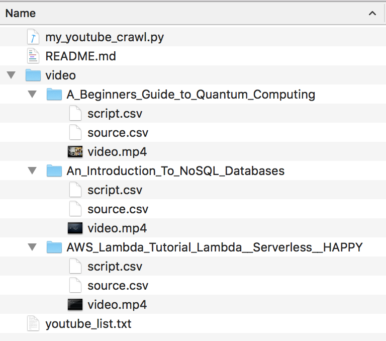

# my_youtube_crawl

For the EFHK1 cohort prototyping

- Download YouTube video in batch mode:
    - Scan each line in youtube_list.txt
    - For each YouTube video link, 
        - A new folder will be created. The folder name is the title of YouTube video 
        - The video clip will be saved as *video.mp4*
        - The machine generated transcript will be saved as *script.csv* (should only be available on video with English voice-over)
        - Some general information about the YouTube video will be stored in *source.csv*
        
## Expected output

  

## Libraries used

- [pytube](https://github.com/nficano/pytube)
- [youtube_transcript_api](https://github.com/jdepoix/youtube-transcript-api)

Both libraries can be installed via *pip*